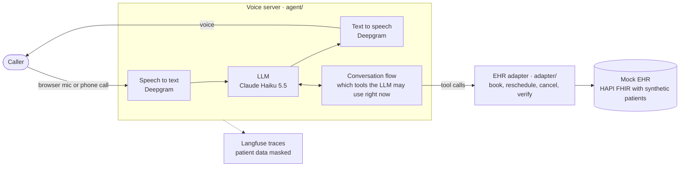
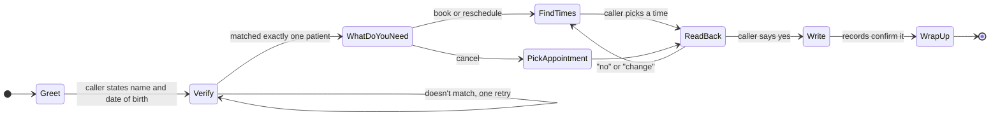
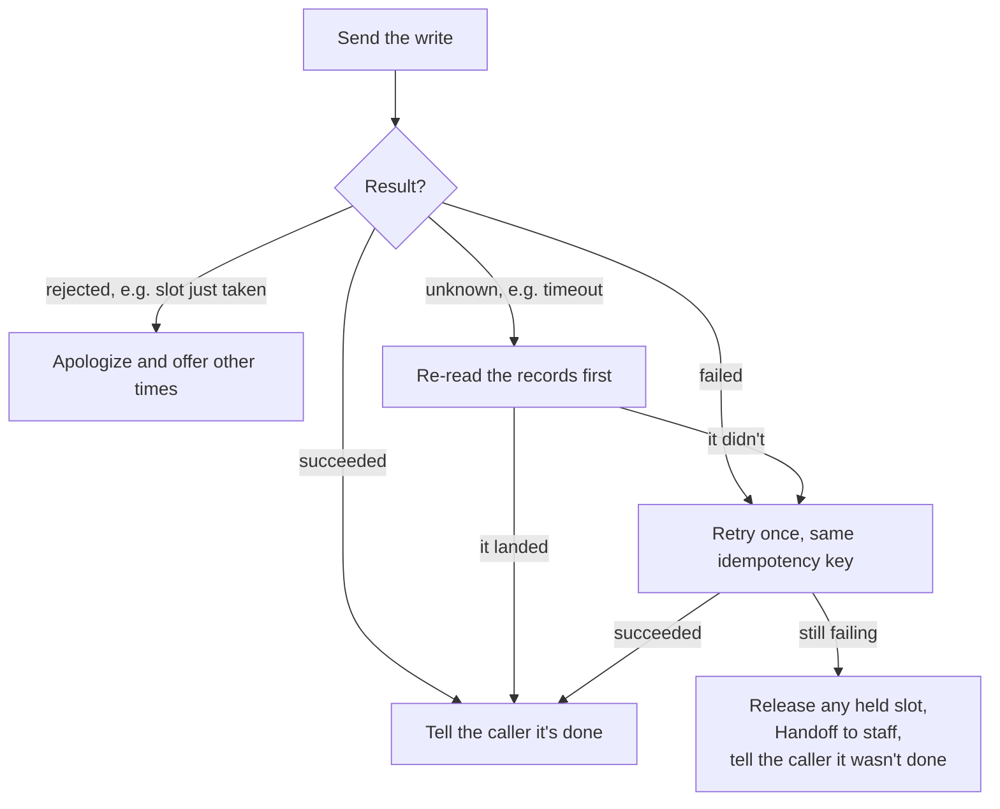

# Clinic Voice Agent

An AI receptionist for a made-up family medicine clinic. You talk to it out loud, from your browser or over a phone call, and it books, moves or cancels your appointment in the clinic's records.

It's a learning project about real-time voice agents: how fast they answer, how they write to a system of record without lying about it, and how to keep patient data out of logs. Every patient in it is synthetic. No real health data goes anywhere.

## What a call sounds like

> **Agent:** Thank you for calling Cedar Hollow Family Medicine. How can I help you today?
>
> **Caller:** Hi, I'd like to book a sick visit.
>
> **Agent:** Sure. What's your full name and date of birth?
>
> **Caller:** Alvaro Hudson, December 25th, 1983.
>
> **Agent:** Thanks, Alvaro. Dr. Whitfield has Tuesday at 9:30 or 10 AM. Dr. Szczepanski has Tuesday at 2 PM.
>
> **Caller:** Tuesday at 10 works.
>
> **Agent:** That's a sick visit with Dr. Marcus Whitfield on Tuesday at 10 AM. Shall I book it?
>
> **Caller:** Yes.
>
> **Agent:** You're booked. Anything else?

The agent only says "you're booked" after the clinic's records confirm it.

## How it works



1. **You speak.** Your voice reaches the server from a browser page on your computer, or from a phone call through Twilio.
2. **Speech becomes text.** Deepgram transcribes what you said as you say it.
3. **The LLM decides what to say or do.** Claude Haiku 5.5 reads the conversation and either answers or calls a tool, like "find open times" or "book this slot".
4. **The conversation flow sets the rules.** At each step it only hands the LLM the tools that step allows. Before you prove who you are, the booking tools don't exist as far as the LLM can tell.
5. **Tools go through the adapter.** A small TypeScript service is the only thing allowed to touch the clinic's records. It speaks FHIR, the healthcare data standard, so the voice server doesn't have to.
6. **Text becomes speech.** Deepgram turns the answer into audio and streams it back. You can interrupt it at any point.

Every call is traced to Langfuse with timing for each step, so you can see where the time goes. Names, dates of birth and phone numbers are masked before anything is logged or traced.

## The conversation, step by step



Two exits are open from every step:

- **Handoff.** The agent files a Callback Request so clinic staff call the caller back. It happens when the caller asks for a person, calls for someone else, isn't a patient yet, asks a medical question, fails to verify twice, or when the records keep failing.
- **Emergency Redirect.** If the caller mentions something like chest pain, the agent tells them to hang up and dial 911, then files an urgent Callback Request.

The agent can also answer simple questions about the clinic, like hours, address and parking, at any time.

## Rules the code enforces

The prompt asks the LLM to behave. These rules don't depend on it, because the code makes breaking them impossible:

| Rule | How |
|---|---|
| Nobody hears a patient's details before proving who they are | Scheduling tools only appear after Identity Verification succeeds |
| Nothing is written without a read-back and a yes | The write tool only appears after the caller's yes is recorded |
| The agent writes exactly what it read back | The write tool takes no arguments |
| It never says "done" unless the records confirm it | The success line is spoken by code, only after a confirmed write |
| No slot gets booked twice | Writes are guarded by the slot's version and an idempotency key |
| Patient data stays out of logs and traces | Masking runs before anything is logged or exported |

Why rules live in code and not in prompts: [ADR 0003](docs/adr/0003-safety-rules-live-in-the-state-machine.md). What data is stored where: [PHI policy](docs/phi-policy.md).

## When the records fail mid-call

Real systems time out, crash and half-finish writes. The adapter can fake each of those on purpose, and the agent handles them like this:



When the records take more than a second, the agent says "One moment while I check on that." so the caller never hears dead air.

## Try it

You'll talk to the agent in your browser. No phone or Twilio account needed.

**You need:**
- [Docker Desktop](https://www.docker.com/products/docker-desktop/), running
- [uv](https://docs.astral.sh/uv/) for Python
- An [Anthropic API key](https://console.anthropic.com/) and a [Deepgram API key](https://console.deepgram.com/). Deepgram gives new accounts free credit.

**1. Add your keys.** Copy `.env.example` to `.env`, then fill in `ANTHROPIC_API_KEY` and `DEEPGRAM_API_KEY`. The rest is optional.

**2. Start the clinic's records.** The first run downloads images and generates the patients, so it takes a few minutes.

```bash
docker compose -f infra/compose.yaml up -d --wait --build
```

**3. Start the voice server.**

```bash
cd agent && uv run --env-file ../.env clinic-voice-server
```

**4. Talk to it.** Open `http://localhost:8765`, click **Connect** and allow the microphone. Use headphones so the agent doesn't hear itself. To get verified, say you're **Alvaro Hudson, born December 25, 1983**.

A ten-turn call costs about a cent of Claude usage on the default model.

**Watch the latency.** After each of your turns, the server terminal prints where the time went:

```text
Response latency:
 0.200s  endpointing wait     [config: VAD stop_secs]
 0.180s  transcription        [DeepgramSTTService#0]
 0.420s  LLM inference        [AnthropicLLMService#0]
 0.250s  speech synthesis     [DeepgramTTSService#0]
 1.050s  TOTAL
```

TOTAL is the time from when you stop talking to when the agent starts answering. The numbers above are made up. Yours appear in your terminal.

To call it from a real phone through Twilio, see [Over the phone](agent/README.md#over-the-phone).

## Run the tests

None of these need API keys. A scripted fake stands in for the LLM. Start the records first, as in step 2.

```bash
cd adapter && pnpm install && pnpm test
```

```bash
cd agent && uv run pytest
```

```bash
cd evals && uv run pytest
```

```bash
cd fhir && uv run pytest
```

The adapter tests need Node 24 and pnpm. The [evals](evals/README.md) can also run whole conversations against a real LLM, with a second LLM playing the patient, and score them. Those runs cost money and never run in CI.

## What's in the repo

```text
agent/      Voice server: audio pipeline, conversation flow, PHI masking (Python)
adapter/    EHR adapter: the only code that touches the records (TypeScript)
fhir/       Seeds the mock EHR with synthetic patients, doctors and open slots
evals/      Scenario-based evals with a simulated caller and graders
infra/      Docker Compose for the mock EHR and the adapter
docs/       Plan, decision records, PHI policy
clinic.json The clinic's hours, time zone, booking window and doctors
```

## Learn more

- [Voice server](agent/README.md): browser and phone setup, the conversation in detail, reading latency in Langfuse
- [EHR adapter](adapter/README.md): every endpoint, the four write outcomes, fault injection
- [Local EHR](fhir/README.md): what the seed creates and how to reset it
- [Evals](evals/README.md): scenarios, graders and the report
- [Glossary](GLOSSARY.md): what words like Slot, Read-back and Handoff mean here
- [Decisions](docs/adr/): why a separate adapter, why Pipecat, why rules in code
- [Plan](docs/PLAN.md): milestones and what's left

## Latency baseline

Not measured yet. After a few real browser calls on the default config, record the typical LLM time to first token and voice-to-voice latency here.
